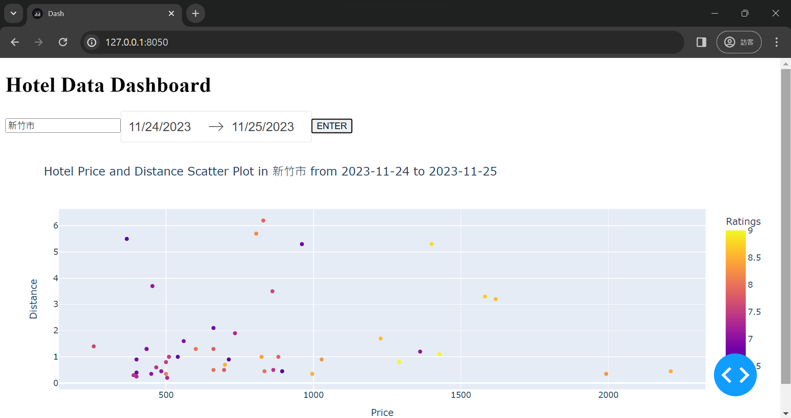

# Hotel Data Dashboard

This project is a web application that fetches hotel data from Booking.com using a web crawler and displays it in a dashboard using Dash.

## Contents

- [Demo](#demo)
- [Installation](#installation)
- [Usage](#usage)
- [File Descriptions](#file-descriptions)
- [Dependencies](#dependencies)
- [Contributing](#contributing)

## Demo



## Installation

1. Clone the repository:

    ```bash
    git clone https://github.com/your-username/hotel-data-dashboard.git
    ```

2. Install the required dependencies:

    ```bash
    pip install -r requirements.txt
    ```

## Usage

1. Run the web crawler to fetch hotel data:

    ```bash
    python webcrawler.py
    ```

   The data will be saved in a CSV file.

2. Launch the dashboard application:

    ```bash
    python app.py
    ```

   Open a web browser and go to [http://127.0.0.1:8050/](http://127.0.0.1:8050/) to view the dashboard.

## File Descriptions

- **app.py:** Dash application that visualizes hotel data fetched by the web crawler. It includes user input fields for location and date range.

- **webcrawler.py:** Web crawler script that fetches hotel data from Booking.com based on user input (location, check-in date, check-out date). The data is then stored in a CSV file.

## Dependencies

- [Dash](https://dash.plotly.com/)
- [Selenium](https://www.selenium.dev/)
- [Beautiful Soup](https://www.crummy.com/software/BeautifulSoup/)
- [Plotly](https://plotly.com/)
- [pandas](https://pandas.pydata.org/)

